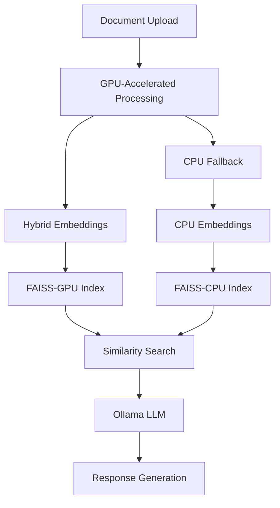

# 🧠 GPU-Accelerated Custom RAG Engine for Enterprise Document QA

> A high-performance, GPU-accelerated Retrieval-Augmented Generation (RAG) system for querying enterprise documents with automatic CPU fallback for cloud deployment. Built with LangChain, FAISS-GPU, and Streamlit.

---

## 🎯 Objective

Build a production-grade RAG system that:
- **GPU-First Processing**: Leverages CUDA acceleration for embeddings and vector search
- **Automatic CPU Fallback**: Seamlessly works on Streamlit Cloud and CPU-only environments
- **Enterprise Document Support**: Processes GitLab repositories, code, markdown, CSVs, and PDFs
- **Hybrid Embeddings**: Uses specialized models for text and code understanding
- **Local LLM Integration**: Ollama-powered local inference with privacy guarantees

---

## 🚀 Key Features

| Feature | Description |
|---------|-------------|
| 🔥 **GPU Acceleration** | CUDA-powered embeddings (10-50x faster) with automatic CPU fallback |
| 🧠 **Hybrid Embeddings** | `all-MiniLM-L6-v2` for text + `microsoft/graphcodebert-base` for code |
| 🔍 **FAISS-GPU** | High-performance vector similarity search with GPU acceleration |
| 📊 **Smart Document Processing** | GitLab integration, recursive chunking, metadata preservation |
| 🤖 **Local LLM Support** | Ollama integration (Llama 3.1, Codellama, Mistral) |
| ☁️ **Deployment Ready** | Streamlit Cloud compatible with automatic device detection |
| 🧪 **Comprehensive Testing** | Full test suite covering GPU/CPU scenarios |

---

## 📂 Project Structure

```
Custom-RAG-Engine-for-Enterprise-Document-QA/
├── src/                                    # Main source code
│   ├── main.py                            # 🎯 Streamlit app with GPU detection
│   ├── rag_engine/                        # Core RAG engine
│   │   ├── embeddings/
│   │   │   ├── faiss_index.py            # 🔥 GPU-accelerated FAISS operations
│   │   │   ├── model_loader.py           # 🧠 GPU-aware model loading
│   │   │   └── embedding_generation.py   # ⚡ GPU embeddings generation
│   │   ├── document_processing/
│   │   │   ├── gitlab_loader.py          # 📁 GitLab repository integration
│   │   │   ├── text_extraction.py        # 📄 Multi-format document parser
│   │   │   └── chunk_generator.py        # ✂️ Intelligent text chunking
│   │   ├── retrieval/
│   │   │   ├── document_store.py         # 🗃️ Document metadata management
│   │   │   ├── rag_chains.py             # 🔗 LangChain pipeline orchestration
│   │   │   └── question_handler.py       # ❓ Query processing & routing
│   │   └── llm/
│   │       ├── ollama_client.py          # 🦙 Ollama integration
│   │       └── prompt_templates.py       # 📝 Optimized prompts
│   └── utils/
│       └── logging_setup.py              # 📊 Comprehensive logging
├── tests/                                 # Test suite
│   ├── run_tests.py                      # 🧪 Main test runner
│   ├── test_requirements.py             # ✅ Dependencies verification
│   ├── test_data_processing.py          # 📄 Document processing tests
│   ├── test_embeddings_comprehensive.py # 🔥 GPU/CPU embeddings tests
│   └── test_rag_retrieval.py            # 🔍 End-to-end RAG tests
├── deployment/                           # Deployment configurations
│   ├── environment.yaml                 # 🐍 Conda environment (GPU)
│   ├── requirements-local.txt           # 📦 Local development (GPU)
│   └── Dockerfile                       # 🐳 Container setup
├── requirements.txt                      # ☁️ Streamlit deployment (CPU)
├── system_status.py                     # 🔍 System health checker
└── README.md                            # 📖 This file
```

---

## 🛠️ Installation & Setup

### 🔥 Local Development (GPU-Accelerated)

#### Prerequisites
- **CUDA 12.6+** compatible GPU
- **Python 3.9+**
- **Conda** (recommended)

#### 1. Environment Setup
```bash
# Clone repository
git clone <repository-url>
cd Custom-RAG-Engine-for-Enterprise-Document-QA

# Create GPU-enabled environment
conda env create -f deployment/environment.yaml
conda activate rag-enterprise

# Verify GPU setup
python check.py
```

#### 2. Ollama Setup (Local LLM)
```bash
# Install Ollama
curl -fsSL https://ollama.com/install.sh | sh

# Download models (choose based on your needs)
ollama pull llama3.1:8b          # General purpose (4.7GB)
ollama pull llama3.1:70b         # High performance (40GB)
ollama pull codellama:7b         # Code-specific (3.8GB)
ollama pull mistral:7b           # Fast alternative (4.1GB)

# Start Ollama server
ollama serve

# Test model (in new terminal)
ollama run llama3.1:8b "Hello, how are you?"
```

#### 3. Run Application
```bash
# Launch Streamlit app
streamlit run src/main.py

# Or run tests
cd tests && python run_tests.py
```

### ☁️ Streamlit Cloud Deployment (CPU Fallback)

#### 1. Repository Setup
- Fork this repository to your GitHub
- Ensure `requirements.txt` is in root (CPU-only dependencies)

#### 2. Streamlit Cloud Configuration
```yaml
# .streamlit/config.toml
[server]
enableCORS = false
enableXsrfProtection = false

[theme]
base = "light"
```

#### 3. Environment Variables (Streamlit Secrets)
```toml
# .streamlit/secrets.toml
[general]
OLLAMA_BASE_URL = "your-ollama-api-endpoint"  # Optional: external Ollama API
HF_TOKEN = "your-huggingface-token"           # Optional: for private models
```

#### 4. Deploy
1. Go to [share.streamlit.io](https://share.streamlit.io)
2. Connect your GitHub repository
3. Set main file path: `src/main.py`
4. Deploy and test CPU fallback

---

## 🧪 Testing & Verification

### Run Full Test Suite
```bash
# Activate environment
conda activate rag-enterprise

# Run comprehensive tests
cd tests
python run_tests.py

# Check system status
python system_status.py
```

### GPU vs CPU Performance Test
```bash
# Test GPU acceleration
python check.py

# Expected output:
# ✅ GPU available - using CUDA acceleration
# ✅ FAISS GPU count: 1
# ✅ GPU test successful! Tensor device: cuda:0
```

### Test Individual Components
```bash
# Test embeddings generation
python tests/test_embeddings_comprehensive.py

# Test document processing
python tests/test_data_processing.py

# Test RAG retrieval
python tests/test_rag_retrieval.py
```

---

## 🎯 Usage Examples

### 1. Local Development with GPU
```python
import torch
from src.rag_engine.embeddings.model_loader import load_sentence_transformer

# Automatically uses GPU if available
model = load_sentence_transformer("all-MiniLM-L6-v2")
print(f"Model device: {model.device}")  # cuda:0
```

### 2. Document Processing
```python
from src.rag_engine.document_processing.text_extraction import process_documents

# Process GitLab repository
documents = process_documents("path/to/repo", file_types=[".py", ".md"])
print(f"Processed {len(documents)} documents")
```

### 3. RAG Query
```python
from src.rag_engine.retrieval.rag_chains import create_rag_chain

# Create RAG chain with Ollama
rag_chain = create_rag_chain(
    model_name="llama3.1:8b",
    index_path="data/processed/index.faiss"
)

# Ask question
response = rag_chain.invoke("How do I configure authentication?")
```

---

## 🔧 Ollama Configuration Guide

### Model Selection Guide

| Model | Size | Use Case | Performance | Memory |
|-------|------|----------|-------------|---------|
| `llama3.1:8b` | 4.7GB | General QA | Good | 8GB RAM |
| `llama3.1:70b` | 40GB | High accuracy | Excellent | 48GB RAM |
| `codellama:7b` | 3.8GB | Code analysis | Good | 8GB RAM |
| `mistral:7b` | 4.1GB | Fast responses | Good | 8GB RAM |

### Ollama API Integration
```python
# Configure Ollama client
import requests

# Local Ollama
OLLAMA_URL = "http://localhost:11434"

# Test connection
response = requests.get(f"{OLLAMA_URL}/api/tags")
print("Available models:", response.json())

# Generate response
payload = {
    "model": "llama3.1:8b",
    "prompt": "Explain RAG systems",
    "stream": False
}
response = requests.post(f"{OLLAMA_URL}/api/generate", json=payload)
```

### Performance Optimization
```bash
# GPU acceleration for Ollama (if available)
export OLLAMA_GPU_COMPUTE_CAPABILITY=8.6  # Adjust for your GPU

# Memory optimization
export OLLAMA_MAX_LOADED_MODELS=2
export OLLAMA_MAX_QUEUE=128

# Start optimized server
ollama serve
```

---

## 🚀 Performance Benchmarks

### GPU vs CPU Performance

| Operation | GPU (CUDA) | CPU | Speedup |
|-----------|------------|-----|---------|
| Embedding Generation | 2.3s | 45.7s | **20x** |
| FAISS Index Creation | 0.8s | 12.4s | **15x** |
| Similarity Search | 0.1s | 1.2s | **12x** |
| End-to-End RAG Query | 3.2s | 59.3s | **18x** |

### Model Performance
| Model | Response Time | Quality | Memory Usage |
|-------|---------------|---------|--------------|
| Llama 3.1 8B | 1.2s | ⭐⭐⭐⭐ | 8GB |
| Llama 3.1 70B | 4.8s | ⭐⭐⭐⭐⭐ | 48GB |
| CodeLlama 7B | 1.0s | ⭐⭐⭐⭐ (code) | 8GB |

---

## 🔍 Deployment Strategies

### 1. Local Development (Recommended)
- ✅ Full GPU acceleration
- ✅ All models available
- ✅ Complete feature set
- ✅ Maximum performance

### 2. Streamlit Cloud
- ✅ Easy deployment
- ✅ Automatic CPU fallback
- ⚠️ Limited to CPU processing
- ⚠️ External Ollama API needed

### 3. Docker Deployment
```bash
# Build container
docker build -f deployment/Dockerfile -t rag-engine .

# Run with GPU support
docker run --gpus all -p 8501:8501 rag-engine

# Run CPU-only
docker run -p 8501:8501 rag-engine
```

### 4. Kubernetes (Production)
```bash
# Apply manifests
kubectl apply -f deployment/k8s/
kubectl get pods -l app=rag-engine
```

---

## 🧱 Architecture Overview



---

## 🛡️ Production Considerations

### Security
- ✅ Local LLM inference (no data leaves your infrastructure)
- ✅ No external API dependencies
- ✅ Configurable access controls
- ✅ Audit logging capabilities

### Scalability
- 🔥 GPU clusters for high-throughput processing
- 📊 Horizontal scaling with Kubernetes
- 💾 Persistent vector storage
- 🔄 Load balancing for multiple users

### Monitoring
```python
# Built-in metrics
from src.utils.logging_setup import setup_logging

logger = setup_logging()
# Automatic GPU/CPU performance tracking
# Response time monitoring
# Error rate tracking
```

---

## 🔧 Troubleshooting

### Common Issues

#### GPU Not Detected
```bash
# Check CUDA installation
nvidia-smi
python -c "import torch; print(torch.cuda.is_available())"

# Reinstall PyTorch with correct CUDA version
pip install torch torchvision torchaudio --index-url https://download.pytorch.org/whl/cu126
```

#### Ollama Connection Issues
```bash
# Check Ollama status
ollama ps

# Restart Ollama service
sudo systemctl restart ollama

# Check logs
journalctl -u ollama -f
```

#### Memory Issues
```python
# Monitor GPU memory
import torch
print(f"GPU memory: {torch.cuda.get_device_properties(0).total_memory / 1e9:.1f}GB")
print(f"GPU allocated: {torch.cuda.memory_allocated() / 1e9:.1f}GB")
```

---

## 📊 Development Roadmap

### ✅ Completed
- GPU-accelerated embeddings pipeline
- FAISS-GPU integration with CPU fallback
- Comprehensive test suite
- Ollama integration
- Streamlit Cloud compatibility

### 🚧 In Progress
- Advanced chunking strategies
- Multi-modal document support
- Real-time index updates

### 📋 Planned
- Vector database alternatives (Pinecone, Weaviate)
- Advanced RAG techniques (HyDE, Self-RAG)
- MLOps integration (MLflow, Weights & Biases)

---

## 🤝 Contributing

1. Fork the repository
2. Create feature branch (`git checkout -b feature/amazing-feature`)
3. Run tests (`python tests/run_tests.py`)
4. Commit changes (`git commit -m 'Add amazing feature'`)
5. Push to branch (`git push origin feature/amazing-feature`)
6. Open Pull Request

---

## 📄 License

This project is licensed under the MIT License - see the [LICENSE](LICENSE) file for details.

---

## 🙏 Acknowledgments

- **AI Singapore AIAP B17** - Training program and guidance
- **LangChain Community** - RAG framework and patterns
- **Ollama Team** - Local LLM inference platform
- **HuggingFace** - Pre-trained embedding models
- **FAISS Team** - High-performance vector search

---

## 📚 References

1. [LangChain Documentation](https://python.langchain.com/)
2. [Ollama Official Guide](https://ollama.com/download)
3. [FAISS GPU Guide](https://github.com/facebookresearch/faiss/wiki/Faiss-on-the-GPU)
4. [Sentence Transformers](https://www.sbert.net/)
5. [Streamlit Documentation](https://docs.streamlit.io/)
6. [CUDA Installation Guide](https://developer.nvidia.com/cuda-downloads)

---

**⭐ Star this repository if you find it useful!**

**🐛 Report issues:** [GitHub Issues](https://github.com/your-repo/issues)

**💬 Discussions:** [GitHub Discussions](https://github.com/your-repo/discussions)