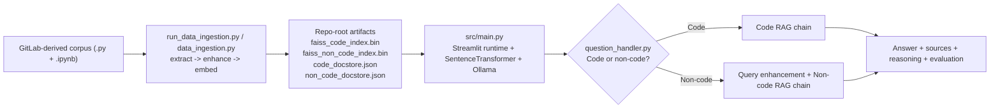

# Custom RAG Engine for Enterprise Document QA

A local-first RAG app for questioning a GitLab-derived corpus of Python files and Jupyter notebooks; the runtime loads prebuilt FAISS/docstore artifacts from the repo root.

The user-facing entrypoint is a Streamlit chat UI that returns answers, retrieved source snippets, reasoning, and evaluation feedback.

<!-- README_SURFACE_START -->

```mermaid
flowchart LR
    A["GitLab-derived corpus (.py + .ipynb)"] --> B["run_data_ingestion.py / data_ingestion.py<br/>extract -> enhance -> embed"]
    B --> C["Repo-root artifacts<br/>faiss_code_index.bin<br/>faiss_non_code_index.bin<br/>code_docstore.json<br/>non_code_docstore.json"]
    C --> D["src/main.py<br/>Streamlit runtime + SentenceTransformer + Ollama"]
    D --> E{"question_handler.py<br/>Code or non-code?"}
    E -->|Code| F["Code RAG chain"]
    E -->|Non-code| G["Query enhancement + Non-code RAG chain"]
    F --> H["Answer + sources + reasoning + evaluation"]
    G --> H
```

[](https://adredes-weslee.github.io/ai/nlp/rag/2024/10/29/building-effective-rag-systems.html)

  

## Quickstart

```bash
pip install -r requirements.txt
python setup_models.py
streamlit run src/main.py
```

See [Setup and Run](#setup-and-run) for the full environment and verification path.

<!-- README_SURFACE_END -->

## Why This Repository Exists

- Make private repo knowledge searchable without external API calls at question time; the app uses local Ollama models and local FAISS indexes.
- Support internal code review, implementation lookup, and technical Q&A over a curated repository corpus, with source documents surfaced back to the user.
- In practice, this is repo-knowledge QA over `.py` and `.ipynb` content, not a general document-QA system.

## Architecture at a Glance

- Ingestion starts from a GitLab-scraped folder tree, walks person/assignment directories, extracts text from `.py` and `.ipynb`, enhances it with Ollama, then saves `faiss_code_index.bin`, `faiss_non_code_index.bin`, `code_docstore.json`, and `non_code_docstore.json` in the repo root.
- Runtime startup loads those root artifacts, builds LangChain FAISS stores, and creates conversational retrieval chains with chat history memory.
- Question handling is split into code vs non-code paths; non-code questions are query-rewritten before retrieval, and the answer path returns retrieved docs plus reasoning.
- Model/device selection is heuristic and environment-aware: `utils/model_config.py` chooses local vs smaller Ollama model names, while `model_loader.py` and `faiss_index.py` opportunistically use CUDA when available.

## Repository Layout

- `config/`
- `deployment/`
- `src/`
- `tests/`
- `utils/`
- `.env.example`
- `.gitignore`
- `code_docstore.json`
- `faiss_code_index.bin`
- `faiss_non_code_index.bin`
- `non_code_docstore.json`
- `README.md`
- `requirements.txt`
- `run_data_ingestion.py`

## Setup and Run

1. Install dependencies from `requirements.txt` or use `deployment/environment.yaml` for the conda/GPU path; the pip file is GPU-oriented, not CPU-only.
2. Start Ollama, then run `python setup_models.py` to pull the Ollama models required by the current environment.
3. If you are rebuilding the corpus, create/populate `data/aiap17-gitlab-data` first; `run_data_ingestion.py --test` uses a small 3-person/10-files-per-person sample, and the full run writes the root-level index/docstore artifacts.
4. Launch the app with `streamlit run src/main.py`; it stops immediately if either FAISS index is missing.
5. For a status check, the actual script in this repo is `system_status.py`, not `check.py`.

## Core Workflows

- Corpus build: GitLab scrape notebook -> folder tree in `data/aiap17-gitlab-data` -> extraction/enhancement -> embeddings -> FAISS/docstore outputs.
- Question answering: Streamlit input -> `handle_question` routes to code or non-code chain -> answer + source docs -> judge pass adds relevance/correctness/completeness feedback.
- Validation: `tests/run_tests.py` runs the dependency, data-processing, embeddings, and retrieval scripts in sequence.
- The tests are mostly smoke/integration checks; `test_data_processing.py` skips actual enhancement unless Ollama is running, and `test_rag_retrieval.py` treats Ollama connection failure as expected success.

## Known Limitations

- The current scope is narrower than the project name suggests: only `.py` and `.ipynb` are indexed, so it is not yet a general enterprise-document QA system.
- `project_embeddings` uses a fresh random matrix each run, so the code-embedding projection is not deterministic or stable across reindexing.
- Source metadata is lossy: extraction stores only basenames, so assignment/path context is dropped before indexing.
- There is a dependency mismatch: `requirements.txt` installs `faiss-gpu`, but `tests/test_requirements.py` checks for `faiss-cpu`.
- Legacy cloud/Azure surfaces remain: `.env.example` and `config/config.py` define Azure-style vars, and `rag_chain.py` still type-annotates `AzureChatOpenAI`, but the real runtime path uses `OllamaLLM`.
- Deployment artifacts are stale: `deployment/start.sh` and `deployment/Dockerfile` still refer to `visiera`, `deployment/deployment.yaml` hardcodes an image tag, and `system_status.py` references a missing `deployment/requirements-local.txt`.
- The repo does not contain the `data/` tree referenced by ingestion and tests, so that input must be supplied externally or recreated from the scraper notebook.
- No benchmark artifacts or profiling outputs are checked in.
